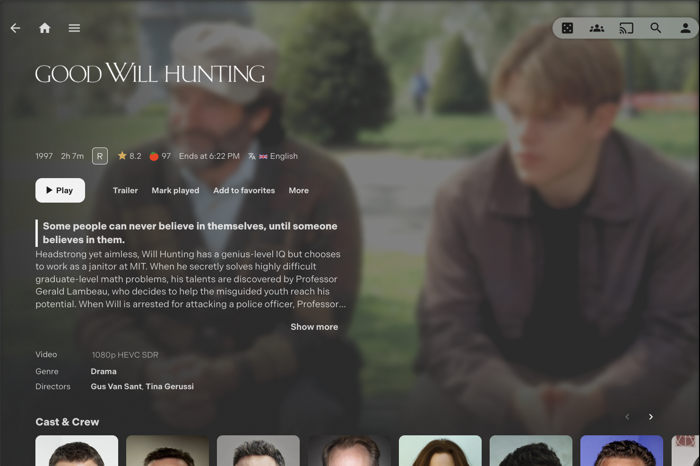
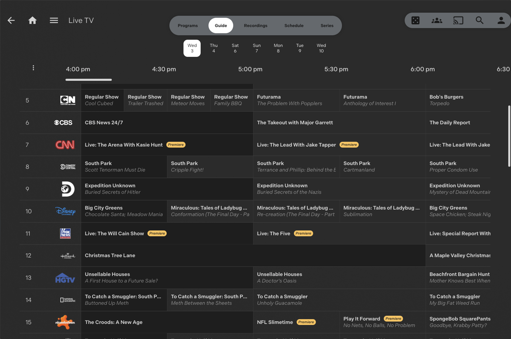

# 🍊 TangyTheme

A minimal and elegant theme for Jellyfin forked from stpnwf's [ZestyTheme](https://github.com/stpnwf/ZestyTheme).

**My goal for this fork is to unify and enhance some styling for my own personal UI/UX preferences wherever I can.**

---

### **Screenshots:**





---

## Installing

To add the theme to Jellyfin `v10.11+`, copy the following line to Dashboard > Branding > Custom CSS:

```
@import url('https://cdn.jsdelivr.net/gh/jpereira99/TangyTheme/theme.css');
```

or for the full suite of enhancements:

```
@import url('https://cdn.jsdelivr.net/gh/jpereira99/TangyTheme/tangy.css');
```

Then, if you haven't already, enable Backdrops for _every_ device using this theme (Settings > Display > Backdrops).¹

Here are the additional plugins that I use in Jellyfin, please refer to each respective GitHub page for instillation instructions

-   [Home Sections](https://github.com/IAmParadox27/jellyfin-plugin-home-sections)
-   [Media Bar](https://github.com/IAmParadox27/jellyfin-plugin-media-bar)
-   [File Transformation](https://github.com/IAmParadox27/jellyfin-plugin-file-transformation)
-   [Plugin Pages](https://github.com/IAmParadox27/jellyfin-plugin-pages)
-   [Jellyfin Enhanced](https://github.com/n00bcodr/Jellyfin-Enhanced)
-   [Jellyfin Tweaks](https://github.com/n00bcodr/JellyfinTweaks)

_TODO: Add a current setup page that documents all the settings I run for each plugin_

### Optional Extras

<details>
<summary>Here are some additional CSS that you can use adhoc to your Custom CSS settings:</summary>

#### Disable DVR Recording

Sets relevant recording buttons around the Live TV screens to `display: none` ; therefore, it is **not** a perfect fix but is a casual enough fix for me.

```
@import url('https://cdn.jsdelivr.net/gh/jpereira99/TangyTheme/extras/disable_dvr_recording.css');
```

</details>

### Notes:

¹ You _must_ enable Backdrops on _every_ device you plan to use this on, otherwise theme **WILL** look broken (Jellyfin Tweaks helps auto-setting that).

This theme looks best with background images whose content is skewed right. [As demonstrated here](./images/extras/bg-guide.jpg).

---

### Disclaimers:

Theme is still **WIP**, and may look broken in some areas. Please report any issues.

**AI Usage:**

This is a fun side-project for me and way to make my Jellyfin experience better. AI was used in the development of my changes to ZestyTheme and I tried to only use it for refactoring, code completions, and to digest and modify the existing framework built up by stpnwf rather than fully "vibe-coding" all of my updates and changes. I know it can be a controversial topic on the utilization of AI in code, but this is CSS theming and not some critical infra that agents autonomously wrote without code review. Just want to be transparent about it's usage as a tool solely intended to make my life while developing this theme easier.
